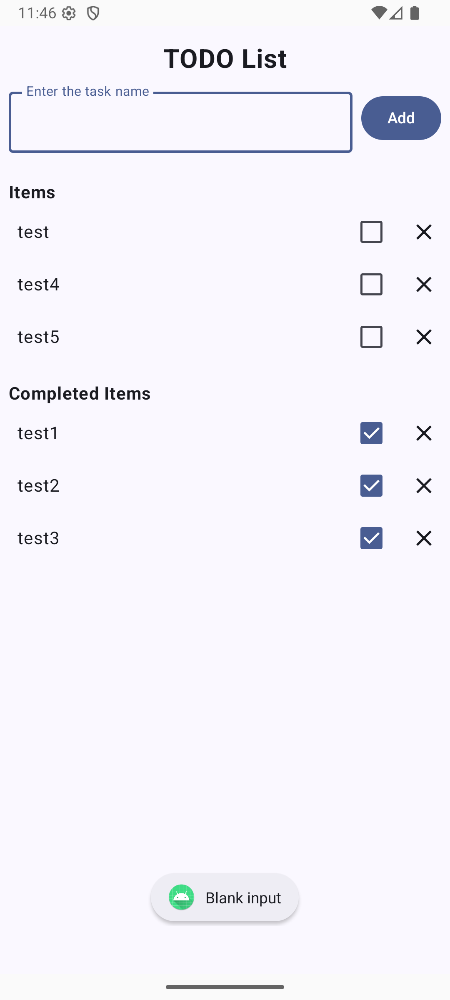
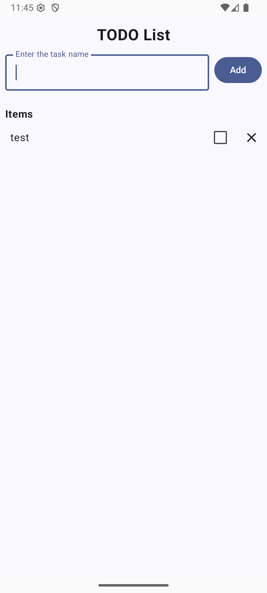
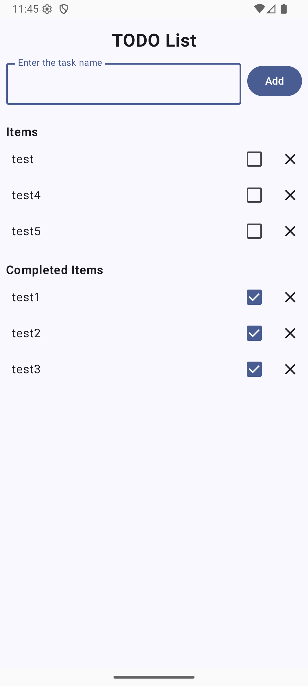
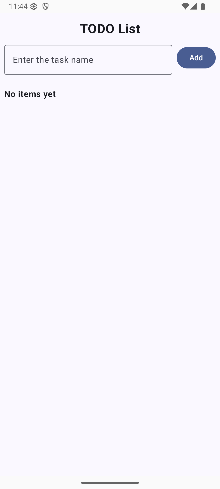
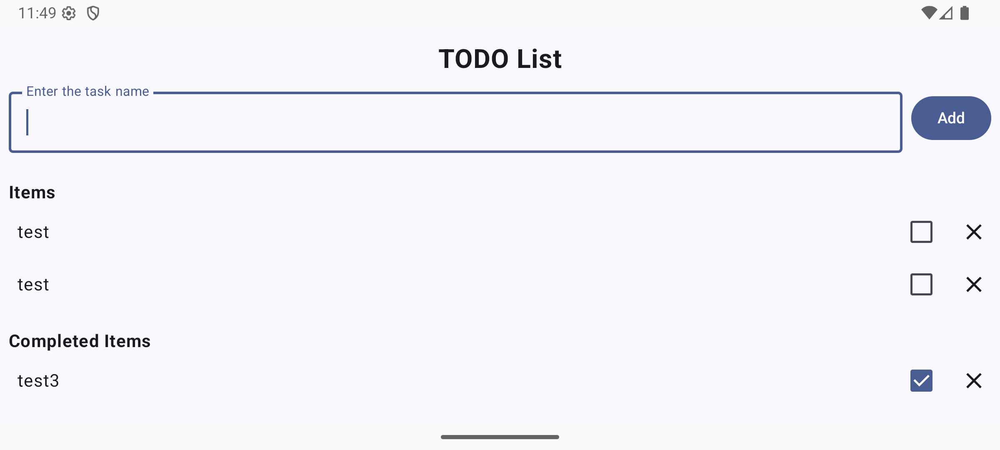

# Android Todo List App with Jetpact Compose

> [YouTube Demo Link](https://youtube.com/shorts/dIekS7F6RyQ?feature=share)

## Features

-   **Add items** via an input field and Add button at the top. Input text is trimmed and ignored if empty (no crash).
-   **Blank-input feedback**: If the user taps Add with empty text, a short Toast says “Blank input.”
-   **Active vs Completed sections**: Items are partitioned into “Items” and “Completed Items”; headers render only when the respective section is non-empty.
-   **Toggle & move**: Checking an item moves it to Completed; unchecking moves it back to Active.
-   **Delete**: Each row includes a close/delete action.
-   **Empty state**: When there are no tasks at all, the list shows a friendly “No items yet.”
-   **Rotation-safe state**: `TodoViewModel` owns the list state; the text field uses `rememberSaveable` so UI survives simple config changes

## Meeting Functional Requirements

-   Add item: Input field + Add button; trims whitespace; ignores blank input with a Toast.<br>
-   Active items: Label + Checkbox; toggling moves to Completed; delete available on each row.<br>
-   Completed items: Same row layout; unchecking moves back to Active; delete works here too.<br>
-   Sections & empty states: “Items” and “Completed Items” only when non-empty; “No items yet” when the whole list is empty.<br>
-   Persistence (session): `ViewModel` for list state + `rememberSaveable` for the input field to survive simple config changes.<br>

## Concepts Used (mapped to Learning Objectives)

1. Model UI data with a data class
   `TodoTask(id, label, initialChecked)` models each row; `checked` is observable Compose state so the row recomposes when toggled.
2. Manage UI state with `mutableStateOf` / `mutableStateListOf` and `rememberSaveable`
    - List state lives in `TodoViewModel` via `mutableStateListOf<TodoTask>()`.
    - Each task’s `checked` uses `mutableStateOf`.
    - The input field uses `rememberSaveable`.
3. State hoisting (stateless UI + events from parents)

-   `TodoTaskItem` is stateless: it receives `checked` and event lambdas (`onCheckedChange`, `onClose`).
-   `TodoTaskList` receives the list and callbacks, forwarding them to each item.
-   `TodoListScreen` wires events to the `ViewModel` (`add`, `remove`, `toggle`).

4. Compose layout with Row/Column, TextField, Button, Checkbox, IconButton
    - Top bar uses `Row` with `OutlinedTextField` and `Button`.
    - Each item row shows `Text`, `Checkbox`, and a `IconButton` (close).
5. Understand recomposition
    - Items are rendered in a `LazyColumn` with stable keys (`id`) to avoid unnecessary recompositions as the list updates.
6. Clean, testable Kotlin with clear unidirectional data flow
    - State down: ViewModel.tasks -> TodoListScreen -> TodoTaskList -> TodoTaskItem.
    - Events up: TodoTaskItem -> TodoTaskList -> TodoListScreen -> ViewModel (add, remove, changeTaskChecked).

## How It Works

1. Entry point & theming: MainActivity sets Compose content, applies the app theme, and shows TodoListScreen within a full-size Surface.
2. Adding tasks: Add trims input and appends a task with an auto-incremented id. Empty or whitespace-only input is ignored (and shows a Toast from the screen).
3. Listing & sections: The list is partitioned into unchecked (Items) and checked (Completed Items). Section headers are conditional; an overall “No items yet” appears when the list is empty.
4. Toggling & deleting: Each row exposes a checkbox and a close icon; toggling updates checked, and close removes the task.

## Project Structure

```
app/
└── src/main/java/com/example/cpsc_411a_todo_app/
    ├── MainActivity.kt        # Sets content/theme; shows TodoListScreen
    ├── TodoListScreen.kt      # Top screen: input + list; shows Toast for blank input
    ├── TodoViewModel.kt       # State owner: add/remove/toggle; trims input
    ├── TodoTask.kt            # Data model with observable 'checked'
    ├── TodoTaskList.kt        # LazyColumn; sections + empty state; stable keys
    └── TodoTaskItem.kt        # Stateless row: label, checkbox, delete
```
